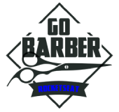

<h1 align="center">



</h1>

<h3 align="center">
This project is part of Rocketseat GoStack | Bootcamp - immersive training on the latest web and mobile development technologies for those who don't have time to waste.
</h3>

## Overview

Web/mobile application to make appointments with professionals.

## What will you learn doing this project

- Starting GoBarber back-end
  - Project basic structure
  - Configure Nodemon & Sucrase
  - Docker concepts
  - Docker configuration
  - Make code looks good (ESLint, Prettier & EditorConfig)
  - Sequelize config
  - User migration
  - User model
  - Loading models
  - User registration
  - Hashing user password
  - JWT concepts
  - JWT authentication
  - Auth middleware
  - User update
  - User date validations


- Part 2
  - Multer configuration
  - User avatar
  - Providers list
  - Appointments migration/model
  - Appointments route/Controller
  - Appointments validations
  - Appointments list
  - Appointments pagination
  - MongoDB configuration
  - Notifing providers about new appointment
  - Notifications list
  - Mark notification as read
  - Cancelling an appointment
  - Nodemailer configuration
  - Email templates configuration
  - Redis queue configuration
  - Watching for queues failures
  - Available appointments time list
  - Adding virtual field to appointments model
  - Exception Handling
  - Environment Variables


## Installation

Clone this project, enter the new clonned folder and type:

```
yarn
yarn dev
```

## Contributing

Ready to learn this exciting stack? Lets code and learn together.
